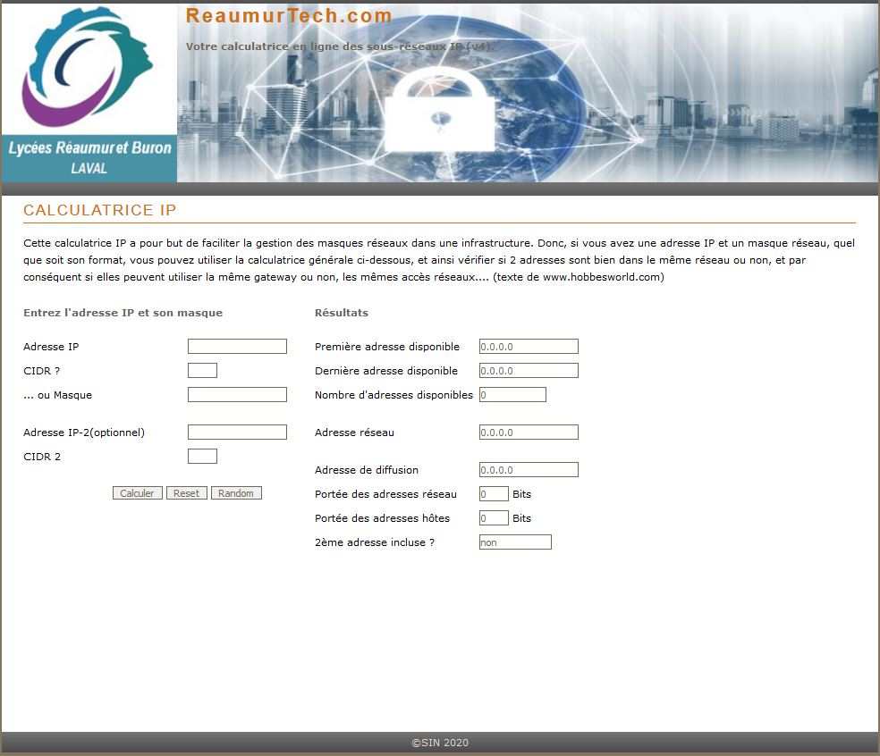

# devoir-calc-ip-via-web

Ce projet consiste à concevoir un site offrant une interface de calcul d'adresses de sous-réseaux.

Ce qui vous est fourni :
* La page html avec les sélecteurs imposés dont il faudra définir les propriétés et leurs valeurs
dans un fichier style.css.
* Les scripts JD de calcul. Vous êtes invités à étudier ces scripts afin d'en comprendre la logique. Il fait appel à des notions de base.
* Les images à intégrer dans le site.

Sous-projet 1:
-------------
Il vous convient d'imaginer le rendu du site par le biais de CSS, conformément à l'illustré fourni.

Sous-projet 2:
-------------
  Tester validité de la saisie de l'utilisateur. Votre site doit signaler toute erreur de saisie.

Sous-projet 3:
-------------
  Ajouter la possibilité de saisir le CIDR. en effet le site fourni ne permet pas à l'utilisateur de saisirle CIDR. Il permet uniquement de saisir la forme classique du masque (255.255.....).

Sous-projet 4:
-------------
Implémenter la fonctionnalité consistant à permettre de vérifier si deux adresses sont dans le 
même réseau et donc capables de communiquer.

Sous-projet 5:
-------------
  Proposer un affichage d'une adresse au hasard (ip+masque)

Sous projet optionnel:
--------------------
   calculer le masque de deux adresses données (cf "Recherche de masque" dans http://hobbesworld.com/reseaux/calcip.php)
   
Attendu:
--------------------

